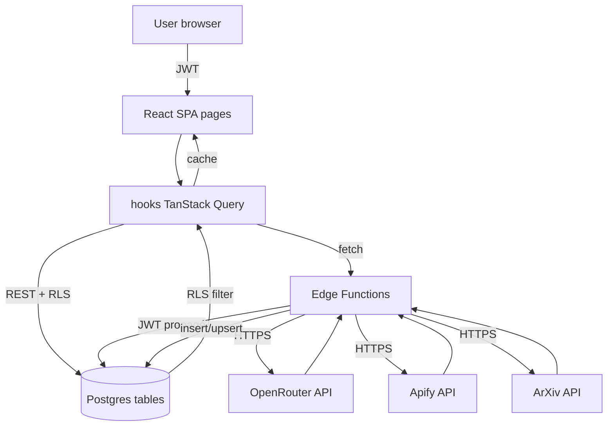
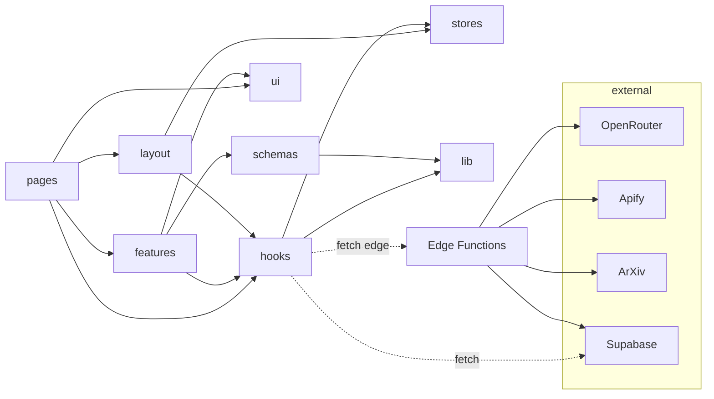

# Carte architecturale des relations

> Critères de complexité atteints : 4/4 (5+ dossiers src, 6 pages routes, 3 domaines metier, 3 sources données externes).

## Inventaire des modules

### Frontend (`src/`)

| Module                 | Chemin                     | Rôle                                                                    |
| ---------------------- | -------------------------- | ----------------------------------------------------------------------- |
| `pages/`               | `src/pages/`               | 6 pages routes (Dashboard, Digest, Costs, Logs, Settings, Login)        |
| `components/ui/`       | `src/components/ui/`       | Primitives shadcn (button, dialog, tabs, slider, select, ...)           |
| `components/layout/`   | `src/components/layout/`   | AppLayout, Sidebar, BrandedHeader                                       |
| `components/features/` | `src/components/features/` | Composants métier (RubricsManager, PurgeButton, ApiKeyForm, ...)        |
| `components/auth/`     | `src/components/auth/`     | ProtectedRoute, AuthListener                                            |
| `hooks/`               | `src/hooks/`               | TanStack Query hooks (useSignals, useDigest, usePurge, useApiKeys, ...) |
| `stores/`              | `src/stores/`              | Zustand auth store                                                      |
| `lib/`                 | `src/lib/`                 | utils, supabase client, openrouter-models, source-meta                  |
| `lib/schemas/`         | `src/lib/schemas/`         | Zod schemas (settings, rubric, api-key)                                 |
| `types/`               | `src/types/`               | DB types (regen Supabase)                                               |

### Backend (`supabase/`)

| Module                       | Chemin                        | Rôle                           |
| ---------------------------- | ----------------------------- | ------------------------------ |
| `migrations/`                | `supabase/migrations/`        | 10 SQL versionnés              |
| `functions/_shared/`         | `supabase/functions/_shared/` | Helper `getUserApiKey`         |
| `functions/run-pipeline/`    | —                             | Orchestrateur scrape + score   |
| `functions/scraper-x/`       | —                             | Apify Twitter list scraper     |
| `functions/scraper-reddit/`  | —                             | Apify Reddit scraper (chunked) |
| `functions/scraper-arxiv/`   | —                             | API officielle ArXiv           |
| `functions/llm-score-batch/` | —                             | Scoring batch (1-30 par appel) |
| `functions/digest/`          | —                             | Brief LLM cross-source         |
| `functions/purge/`           | —                             | Suppression user-data          |

## Matrice de dépendances

| de \ vers    | pages | hooks | features | layout | ui  | stores | lib | schemas | edge fns      | DB                      |
| ------------ | ----- | ----- | -------- | ------ | --- | ------ | --- | ------- | ------------- | ----------------------- |
| **pages**    | —     | ✓     | ✓        | —      | ✓   | —      | ✓   | ✓       | ✓ (via fetch) | —                       |
| **hooks**    | —     | —     | —        | —      | —   | ✓      | ✓   | ✓       | ✓ (via fetch) | ✓ (via supabase client) |
| **features** | —     | ✓     | —        | —      | ✓   | —      | ✓   | ✓       | ✓             | —                       |
| **layout**   | —     | ✓     | —        | —      | ✓   | ✓      | ✓   | —       | —             | —                       |
| **ui**       | —     | —     | —        | —      | ✓   | —      | ✓   | —       | —             | —                       |
| **schemas**  | —     | —     | —        | —      | —   | —      | —   | —       | —             | —                       |
| **edge fns** | —     | —     | —        | —      | —   | —      | —   | —       | ✓ (cross-fn)  | ✓                       |

Légende : ✓ = dépendance directe.

## Flux de données

## Diagramme inter-modules (frontend)

## Chemins critiques (couplage élevé)

1. **`src/hooks/useSettings.ts`** : utilisé par 5+ pages/components (Settings, Dashboard, Costs, AppLayout, useUpdateSettings). Impact d'un change : large. Garder le type `Settings` stable.

2. **`src/lib/schemas/settings-schema.ts`** : source de vérité pour la forme des settings côté front. Toute nouvelle colonne DB doit être reflétée ici, dans `useSettings`, dans `useUpdateSettings`, et dans le mock du test `Settings.test.tsx`. 4 fichiers à maintenir cohérents.

3. **`supabase/functions/_shared/api-keys.ts`** : utilisé par scraper-x, scraper-reddit, llm-score-batch, digest. Si la signature change → 4 fonctions à redéployer.

4. **`supabase/functions/run-pipeline/index.ts`** : orchestrateur. Appelle 3 scrapers + 1 batch scorer. Si une edge fn appelée change son contrat (body shape ou response shape), ce fichier doit être adapté.

5. **`src/types/database.ts`** : types DB. Régénéré via Supabase CLI. Quand obsolète, les hooks `useApiKeys`, `useRubrics`, `useUpdateSettings`, `useDigest` utilisent des casts `as unknown as` jusqu'à régénération.

## Points d'entrée

| Type                 | Entrée                                          | Trigger                     |
| -------------------- | ----------------------------------------------- | --------------------------- |
| Routing client       | `src/main.tsx` → `App.tsx` → `routes.tsx`       | navigation user             |
| Magic link auth      | `/login` page                                   | clic email link             |
| Pipeline manuel      | `/` Dashboard → bouton "Run pipeline"           | clic                        |
| Pipeline auto        | (V2) `pg_cron` → `run-pipeline`                 | schedule horaire/journalier |
| Génération brief     | `/digest` page → bouton "Générer"               | clic                        |
| Purge                | `/` Dashboard → bouton "Purger" + modal         | clic + confirmation         |
| Edge function direct | `https://<ref>.supabase.co/functions/v1/<name>` | curl/scripts (debug)        |

## Multi-tenancy

Pas de tenant explicite. Chaque user Supabase est isolé via RLS sur `auth.uid()`. Pour un usage en équipe (5 personnes), il suffit d'inviter les users dans le projet Supabase. Aucune logique applicative additionnelle.

Une instance = un projet Supabase = N users isolés. Pour scaler à 100+ users : passer à un Supabase plan paid (free tier limit 50 MAU).
