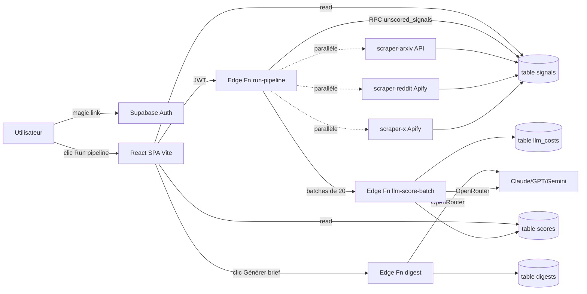
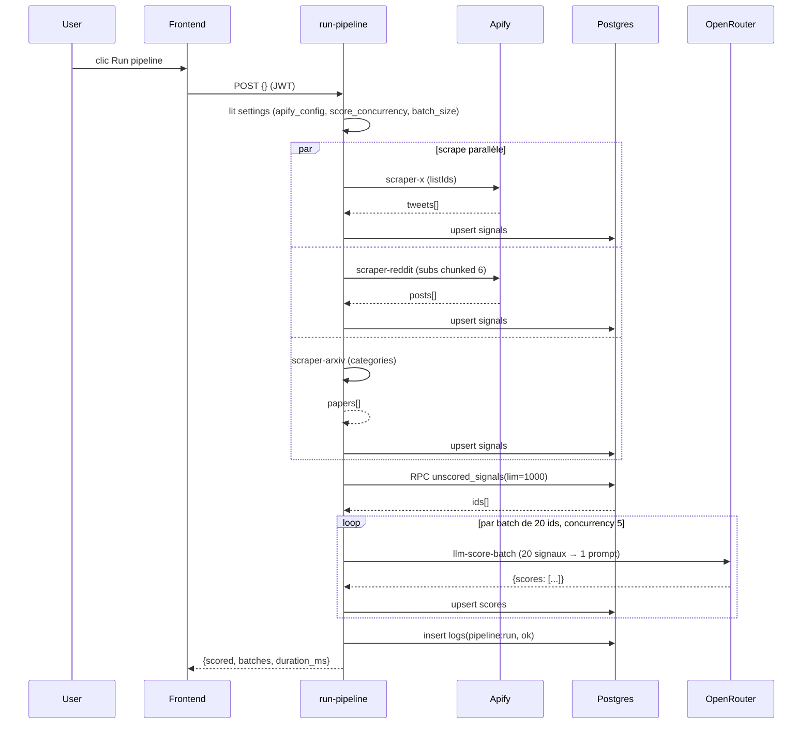
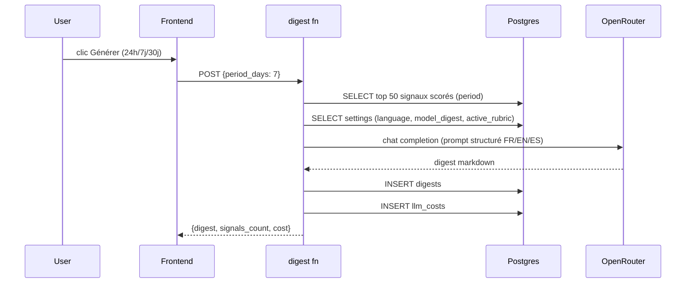

# Architecture

## Vue 1000 pieds



## Couches

### Frontend (`src/`)

SPA Vite + React 19. Pas de SSR. Routing client-side via `react-router-dom`. État serveur via TanStack Query (cache + invalidation). État local auth via Zustand.

5 pages principales :

- `/` — Dashboard (table signaux + filtres + modal détail)
- `/digest` — Brief synthétique LLM (FR/EN/ES)
- `/costs` — Coûts par jour / modèle / tâche
- `/logs` — Activité pipeline + détail OpenRouter
- `/settings` — 5 onglets (modèles, grilles scoring, sources, clés API, branding+budget)

### Backend (`supabase/`)

**Postgres** : 9 tables principales (`signals`, `scores`, `logs`, `llm_costs`, `settings`, `user_api_keys`, `scoring_rubrics`, `digests`, + storage `branding`). RLS partout, policies `own_*` (filtrage par `user_id = auth.uid()`).

**Edge Functions Deno** (7 fonctions) :

- `run-pipeline` — orchestrateur (scrape parallèle + score batches)
- `scraper-x` — Apify `apidojo/twitter-list-scraper`
- `scraper-reddit` — Apify `automation-lab/reddit-scraper`, chunké 6 subs/run
- `scraper-arxiv` — API officielle ArXiv (rate limit 3s)
- `llm-score-batch` — score 1-30 signaux par appel OpenRouter
- `digest` — synthèse cross-sources 80/20
- `purge` — suppression user-data (signals seuls ou tout)

**pg_cron** : purge automatique des logs > 24h toutes les heures.

### Externe

- **OpenRouter** (proxy LLM) : appelé via SDK `openai` v4 pointé sur `openrouter.ai/api/v1`. Modèles configurables par user (4 slots : scraping/scoring/monitoring/digest).
- **Apify** : 2 acteurs paid pour X et Reddit. Format `run-sync-get-dataset-items`.
- **ArXiv** : API Atom XML officielle.

## Flux de données

### Pipeline complet (Run pipeline)



### Génération de brief



## Arborescence (raccourcie)

```
/
├── src/
│   ├── App.tsx, main.tsx, routes.tsx        ← bootstrap
│   ├── pages/                                ← 6 pages (Dashboard, Digest, Costs, Logs, Settings, Login)
│   ├── components/
│   │   ├── ui/                               ← primitives shadcn (button, dialog, tabs, slider, ...)
│   │   ├── layout/                           ← AppLayout, Sidebar, BrandedHeader
│   │   ├── auth/                             ← ProtectedRoute, AuthListener
│   │   └── features/                         ← composants métier (PurgeButton, RubricsManager, ...)
│   ├── hooks/                                ← TanStack Query hooks (useSignals, useDigest, usePurge, ...)
│   ├── stores/auth.ts                        ← Zustand auth
│   ├── lib/
│   │   ├── supabase.ts                       ← client browser (anon)
│   │   ├── schemas/                          ← Zod (settings, rubric, api-key)
│   │   └── utils.ts, openrouter-models.ts, source-meta.ts
│   ├── types/database.ts                     ← types DB (regen Supabase)
│   └── test/setup.ts                         ← Vitest setup
│
├── supabase/
│   ├── migrations/ (10 fichiers)             ← SQL versionnés
│   └── functions/
│       ├── _shared/api-keys.ts               ← helper getUserApiKey
│       ├── run-pipeline/index.ts             ← orchestrateur
│       ├── scraper-{x,reddit,arxiv}/index.ts ← 3 scrapers
│       ├── llm-score-batch/index.ts          ← scoring batchifié
│       ├── digest/index.ts                   ← brief LLM
│       └── purge/index.ts                    ← suppression user-data
│
├── specs/
│   ├── SOURCES.md                            ← référence 241 sources veille IA
│   ├── done/                                 ← specs implémentées (audit historique)
│   └── handoffs/                             ← notes de session
│
├── docs/                                     ← cette documentation
└── public/                                   ← assets statiques
```

## Choix architecturaux clés

Voir [ADRs](./architecture/adrs/) pour le détail. Résumé :

1. **Vite + SPA, pas Next.js** : pas de SEO besoin, pas de SSR. Build 5× plus rapide, moins de boilerplate.
2. **Supabase Edge Functions Deno** : single-vendor, zero-config, JWT user passé automatiquement aux RLS policies.
3. **OpenRouter + batch scoring** : 1 appel LLM = 20 signaux scorés. 4-5× plus rapide qu'un scoring séquentiel.
4. **Apify > API officielle** pour X (X v2 = $200/mois min) et Reddit (rate limits agressifs, JSON instable).
