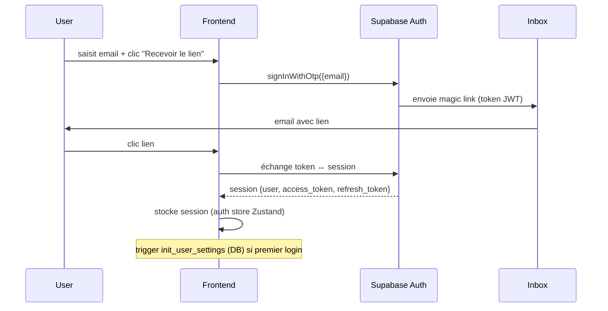

# Authentification

## Stratégie

**Magic link** (email-based, passwordless) via Supabase Auth. Pas d'OAuth social pour V1, pas de password traditionnel.

## Flow



## Code

### Frontend

- `src/pages/Login.tsx` : formulaire `signInWithOtp`
- `src/stores/auth.ts` : Zustand store `{user, session, loading, setSession, signOut}`
- `src/components/auth/AuthListener.tsx` : écoute `onAuthStateChange`, sync avec store
- `src/components/auth/ProtectedRoute.tsx` : redirige `/login` si pas de session

### Backend

Toutes les Edge Functions valident le JWT :

```ts
const {
  data: { user },
} = await supabase.auth.getUser()
if (!user) return json({ error: 'invalid_token' }, 401)
```

## Trigger `init_user_settings`

Sur `INSERT INTO auth.users` (donc à chaque signup), un trigger crée :

1. Un rubric default "Default builder IA" avec 6 critères pondérés (innovation 0.25, actionable 0.20, crédibilité 0.15, récence 0.15, profondeur 0.15, builder-fit 0.10)
2. Une row `settings` pour le user pointant vers ce rubric (`active_rubric_id`)

Code dans `supabase/migrations/20260430000006_modular_config.sql` (mise à jour de la fonction `public.init_user_settings`).

## Gestion de session

- **Persistance** : Supabase stocke la session dans `localStorage` du browser (clé `sb-<ref>-auth-token`)
- **Refresh** : auto-refresh des tokens via le client Supabase (pas besoin de gérer manuellement)
- **Sign out** : `useAuthStore.getState().signOut()` → appelle `supabase.auth.signOut()` → `onAuthStateChange` listener vide le store

## Multi-device

Le user peut être connecté sur plusieurs devices simultanément (chaque device a sa propre session JWT). Les RLS isolent par `auth.uid()` qui reste identique cross-devices.

## Reset password / changement email

V1 ne couvre pas. À ajouter en V2 :

- `supabase.auth.updateUser({ email })` pour changer email
- Pas de password à reset puisqu'il n'y en a pas. Pour bloquer un compte compromis : delete dans Supabase Dashboard.

## Debug

- Pas de magic link reçu : vérifier Supabase Dashboard → Auth → Email templates + SMTP config (par défaut Supabase utilise son SMTP, peut être lent)
- Token expired sur Edge Function : le client devrait auto-refresh. Si bloqué : forcer un sign out + sign in
- "Database error querying schema" sur signup : `.env` mal configuré (URL ou anon key). C'est jamais le code applicatif.
